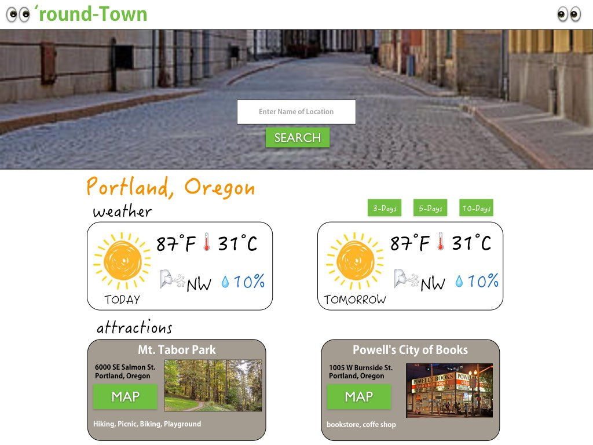
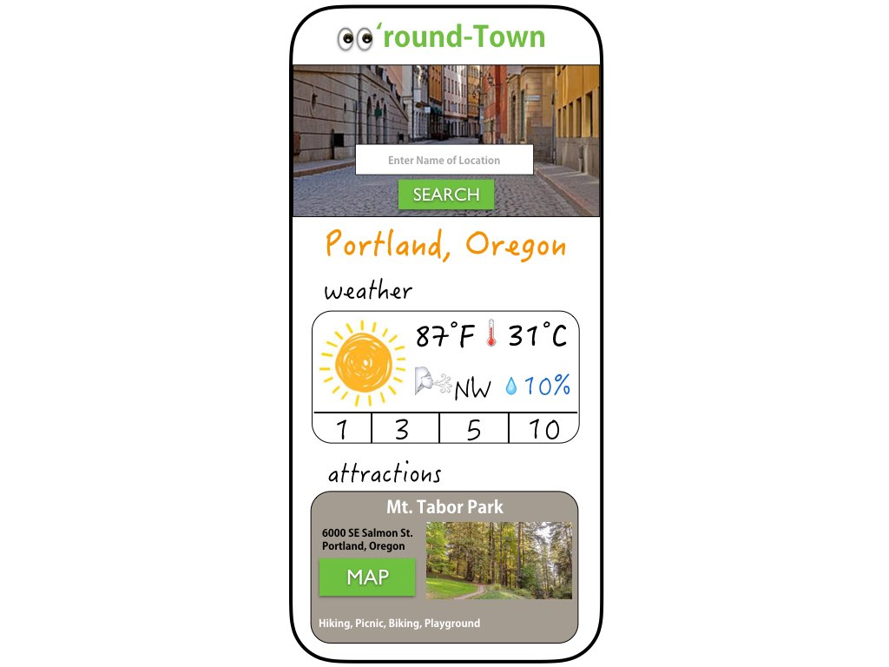
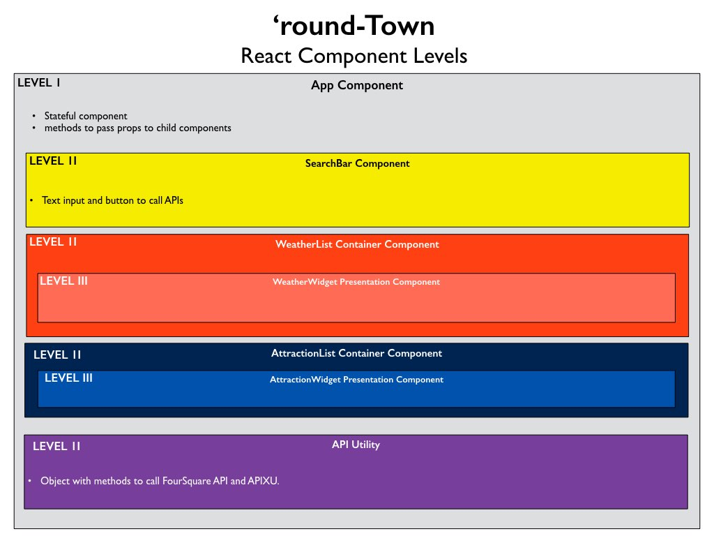

__Title__: 'round-Town

__By__: Steve Hanlon created on Jan. 9, 2018

__Goal__: Develop a React-based travel App that provides local weather information and a city's/town's top attractions.

#### Work flow
1. Develop index.html static site with hard-coded content using FourSquare API and APIXU.
2. Create React project and Component Map

3. Create Component Directories with JS and CSS files.
4. Copy/Paste the hard-coded HTML and CSS into the various React components, rewrite file/link paths

5. Create logic through methods, pass props, onClick and onChange handlers
  - App
    - set state for weather widget and attraction widget
    - method to call utility methods that call APIs
  - SearchBar
    - Text Input onChange to update state
    - Button onClick to call handler that calls APIs
  - WeatherList
  - WeatherWidget
  - AttractionList
  - AttractionWidget
    - Set up onClick handler and State of player choice
  - Utility JS file
    - Initialize keys
    - create methods to calls both APIs

#### Programming flow

#### Future Feature Requests
